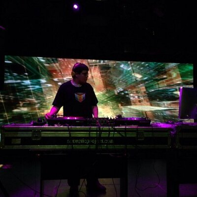

### Angel Gabriel Legorreta González

Mi nombre es Angel tengo 23 años y estoy estudiando 3 carreras diseño grafico, programación y doblaje

- [Mi correo es este:](cdmx1895@amerike.edu.mx)
- [Tu perfil de _GitHub_ es: ](https://github.com/SrAlmeja)

---

### Daniel Eduardo Navarrete Flores

Soy estudiante de 6to grado de Universidad en la ingeneria de desarollo de software interactivo y videojuegos, soy originario del estado de México pero actualmente vivo en la cdmx para ahorrar tiempo dinero

- [Correo Institucional Daniel Navarrerte](cdmx1831@amerike.edu.mx)
- [Leinad DH](https://github.com/LeinadDH)

### Diana Ramos Garcia
Hola me llamo Diana pero igual me conocen como Dino, tengo 21 años y vivo en la cdmx. 
Soy programadxr y estudiante de videojuegos y actualmente estoy trabajando en un pequeño estudio mexicano de Mérida, Yucatán.

- [Correo Institucional](cdmx1814@amerike.edu.mx)
- [Github Dinorekkos](https://github.com/Dinorekkos)

---

### Fernando Javier Cossio Ruiz

Estudiante de dev de videojuegos. Buscando entrar al AAA y escapar de latinoamérica :V 

- [Mi correo](cdmx1949@amerike.edu.mx)
- [Mi GitHub](https://github.com/Fernando747400)

---

### Raymundo Giron Mosqueda 

Soy Raymundo Giron Mosqueda. Estudiante de Desarrollo de software interactivo y
video juegos.  

- [cdmx1778@amerike.edu.mx](cdmx1778@amerike.edu.mx)
- [Mi Github](cdmx1778@amerike.edu.mx)  

---

